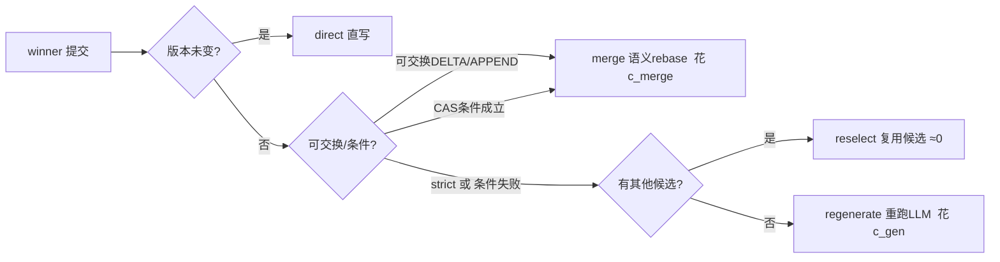

# CAST 组会汇报：三方对比 + 成本模型 / 提交协议 / 正确性边界

> 三方 = strict OCC（baseline）· SCC-kS（投机并发）· **CAST**（ours）；另含 2PL / MVCC-SI 对照。
> 本汇报把三件事讲到位：**成本模型讲硬、提交协议讲清、正确性边界讲死**，最后给下一步探索。
> 全部实验在 `cast-das/`，可复现；图在 `agent/experiments/results/`。

---

## 0. 一页背景（先立靶子）

LLM agent 任务是**探索式**（生成多候选选 winner）且**执行极贵**（每候选 = 秒级 LLM + token）。
经典并发控制（OCC/SCC）的两个隐含假设在此失效：
- OCC：abort 便宜 → 但 agent 的 abort = 重跑 LLM；
- SCC：冗余探索便宜 → 但每个 shadow 都是一次昂贵生成。

> **CAST 一句话**：当探索成本被反转，并发控制的最优策略也反转——**验证层按语义放行可化解的并发（减少冲突），真冲突时用便宜的合并/候选复用替代昂贵重跑**。

---

## 1. 成本模型（讲硬）

### 1.1 成本项定义与量级（不对称的来源）

| 成本项 | 含义 | 量级 |
|---|---|---|
| `c_gen` | 一次候选生成（LLM 推理 + 工具调用 + token） | **秒级**（~1–10 s，含 $ token） |
| `c_merge` | 一次语义 rebase（纯 KV 算术 / 字符串拼接） | **微秒级**（KV 操作） |
| `c_reselect` | 复用已生成候选（无新生成） | ≈ 0 额外 |
| `c_validate` | 版本/条件校验 | ≈ 0 |

> 关键比值 **`c_gen / c_merge ≈ 10⁴–10⁶`**。这就是"成本不对称"的硬事实，也是 CAST 的立论根基。
> 优化目标随之改变：**不是最大化吞吐，而是最小化为提交一个合格 winner 所浪费的 LLM 算力。**

### 1.2 各策略的人均浪费（闭式，单位 c_gen/任务）

设：冲突概率 `p`、可合并写占比 `m`、reselect 命中率 `h`、投机候选数 `k`、`ε = c_merge/c_gen ≈ 0`。

| 策略 | 人均浪费（闭式） | 解读 |
|---|---|---|
| **OCC** | `p · 1` | 任一冲突 → 整事务重跑一次 LLM |
| **SCC-kS** | `(k−1)·1 + p_k·1` | 每任务先付 k−1 份冗余 shadow；深度≥k 再重跑 |
| **CAST** | `p · [ m·ε + (1−m)·(1−h)·1 ]` | 可合并冲突→merge(≈0)；strict 冲突→reselect(≈0)，失败才重跑 |

要点：CAST 的浪费里，**可合并写那项几乎归零**（`m·ε`），只剩"strict 冲突且 reselect 失败"才花 `c_gen`。
SCC 的 `(k−1)` 项是**无条件冗余**——在 `c_gen` 巨大的 agent 场景，投机永远不划算（实测 k\*=1 退化成 OCC）。

### 1.3 数据支撑

- **成本不对称扫描**（`results/sweeps3.png`）：c_merge≪c_gen 时 CAST 省 >97%；**交叉点 c_merge≈0.4·c_gen** 后 CAST 才不划算——印证"不对称越大、CAST 越赢"。
- **三维**（`results/timed.png`，batch=16）：浪费/任务 OCC 0.66 / 2PL 0 / CAST 0.02；延迟 1.66/2.38/1.02；吞吐 1.4/3.0/**12.0**。
- **真实 VitaBench OTA**（`results/vitabench_ota.png`）：`use_tool` 实测订票扣座位（DELTA）；batch=16 时 **OCC 的 200 次重跑被 CAST 全部转成 200 次合并**，吞吐 2.67→15.2。

---

## 2. 提交协议（讲清）

CAST 一个任务的提交分**两阶段**：先按语义分级**验证**（决定算不算冲突），再按成本**解决**冲突。

### 2.1 阶段一：语义感知验证（按写意图分级）

| 写意图 | 并发类 | 验证规则 |
|---|---|---|
| READ | read-only | **放行**（读从快照，不参与写写验证）|
| APPEND / DELTA | commutative | **放行**（可交换，不因版本变判冲突）|
| CAS | conditional | 提交时**重检条件** |
| OVERWRITE | strict | **严格版本校验**（first-committer-wins）|

→ 对比：OCC 读写全严格；MVCC-SI 只放行读；**CAST 还放行可交换写**（这是"减少冲突"的关键）。

### 2.2 阶段二：成本不对称冲突解决（状态机）



优先级：**direct → merge → reselect → regenerate**，把唯一昂贵的 `regenerate` 压到最后。
（实现见 `core/txn/cost_asymmetric_commit.h`。）

### 2.3 走一个例子（订机票，端到端）

任务"订周五去上海的机票并记备忘"，agent 生成 3 个异构候选（MU/CA/HU 航班），winner=MU（最便宜）。
并发用户同时订了 MU 同舱位 → `flight:MU:economy.quantity` 版本前进。
- **验证**：MU 座位是 DELTA（可交换）→ **放行**；备忘 APPEND → 放行。
- **解决**：在最新库存上 rebase `−1` → `merge` 成功（花 c_merge）。
- **若 MU 售罄**（条件失败）→ `reselect` 候选 CA（有座）直接提交（≈0）。
- 对比 OCC：版本变 → 整事务 abort → **重跑 LLM 重新规划**（花 c_gen）。

---

## 3. 正确性边界（讲死）

### 3.1 CAST 按写意图分别给出的保证

| 写意图 | 提交规则 | 正确性保证 |
|---|---|---|
| strict（OVERWRITE） | 版本校验 + first-committer-wins | **可串行化**（与 OCC 等价）|
| 可交换（DELTA/APPEND） | 提交时 rebase 到最新值再写 | **收敛 / 不丢更新**：合并结果 = 各增量之和，因可交换 ⇒ 与任意串行序结果相同 ⇒ **可串行化 w.r.t. 写** |
| 条件（CAS） | 提交时重检条件 | 条件成立才提交，**不在条件失效时落库** |

**定理（草图，待形式化）**：若所有被"放行"的写都是**真可交换**且**无下界/容量约束**，则 CAST 的提交历史
等价于某个串行执行（对写而言）；strict 写满足 first-committer-wins；CAS 满足条件正确性。

### 3.2 明确**不保证**的（这是"讲死"的核心，组会主动交代）

1. **带下界/容量约束的可交换写 → 会破约束（超卖）**。
   实测（`results`/`correctness_boundary.py`）：库存 5、8 个并发 `DELTA(-1)`，纯 DELTA 放行合并 = **−3（超卖）**——
   合并值与串行一致（收敛对），但违反"库存≥0"。**可交换性 ≠ 约束安全。**
   → 缓解：把"扣减且不破约束"建模为 **conditional(CAS/escrow)**，由 CAST 的 conditional-rebase 提交时重检；
   实测 conditional 扣减：成功 5 / 拒绝 3 / 库存 0 → **不超卖**。
2. **读依赖 / write-skew**：CAST 放行读集（读从快照），与 **MVCC-SI 同级**——允许 write-skew，
   **不保证读依赖的可串行化**。这是为吞吐主动放弃的（明确声明）。
3. **跨对象不变量**：对象级合并**不检测**跨对象约束（如"多笔订单总额 ≤ 预算"）。
4. **顺序敏感的 APPEND**：若结果依赖追加顺序，合并产生的顺序可能非预期——APPEND 的放行前提是**顺序无关**（multiset 语义）。

### 3.3 一句话边界

> **CAST 放行可交换写 ⇒ 保证收敛/不丢更新（可串行化 w.r.t. 写）；但不保证带约束的不变量、读依赖（write-skew）、跨对象不变量。**
> 需要这些保证时，把对应写从 commutative 降级为 conditional / strict —— 这正是"语义感知"分级验证的可调旋钮。

---

## 4. 下一步探索（组会讨论点）

1. **隔离级别形式化**（最高优先，冲顶会必需）：把 §3.1 定理证严，给出 CAST 的**精确混合隔离级别**
   （strict 部分可串行化 + 可交换部分收敛 + 读 SI）。锚定标准（Adya / Crooks state-based / Xiong 的 versioned-KV client 事务语义）。
2. **escrow 式约束表达**：把"带下界/容量的扣减"（订票扣座位、库存）用 **escrow（额度预留）** 表达——
   既保留并发合并，又不破约束。**这能把当前的超卖边界从"不保证"变成"可合并收益"，直接扩大 CAST 的收益面**。
3. **自适应验证策略**：`CandidateScheduler` 升级——按对象的约束/争用特征自动选 commutative / conditional / strict，
   并决定投机度 k（strict-heavy 时多开候选用 reselect 兜底）。
4. **真实 LLM-in-the-loop**：用真实 LLM 测 `c_gen` 分布、产生真实候选与冲突分布，替换对数正态模拟。
5. **跨域更高争用 + 读密集真实负载**：VitaBench cross_domain 提高争用；读密集场景让 MVCC-SI 的"读不阻塞"显现，
   与 CAST 进一步区分。

### 开放问题（请组会拍）
- 隔离级别该锚到哪个标准？"可交换写收敛 + 读 SI"的混合级别如何命名与证明？
- escrow 能否覆盖 VitaBench 的座位/库存约束，把"超卖边界"转成"可合并收益"？
- "agent 任务固有会生成多候选"这一假设的真实性——真实 LLM agent 平均产生多少候选？（决定 reselect 那条收益线的强度）

---

## 附：可复现命令

```bash
cd cast-das && bash build.sh
python3 agent/experiments/sweep_contention.py        # 三方成本扫描 -> sweeps3.png
python3 agent/experiments/timed_experiment.py        # 成本×延迟×吞吐 -> timed.png
python3 agent/experiments/explore_experiment.py      # 多候选 reselect -> explore.png
python3 agent/experiments/semantic_validation_experiment.py   # 语义验证分级 -> semantic_validation.png
python3 agent/experiments/correctness_boundary.py    # 正确性边界（超卖/安全）
bash agent/integrations/setup_vitabench.sh && cd /tmp/vb && \
  python3 .../agent/integrations/vitabench_ota_concurrency.py   # 真实 OTA -> vitabench_ota.png
```
